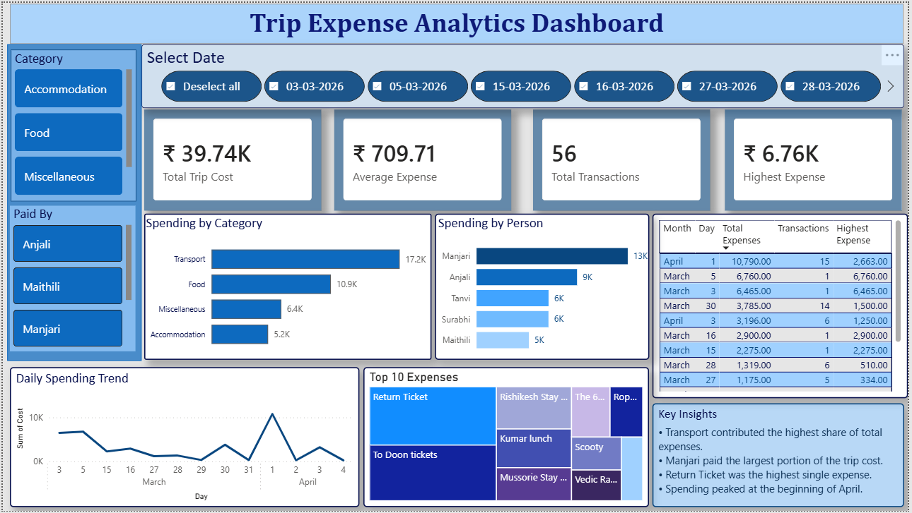

# Trip Expense Analytics

End-to-End Data Analytics Project using Excel, SQL, Python and Power BI

## Project Overview

This project analyzes personal trip expenses to identify spending patterns, major cost drivers, contributor-wise expenses, and daily expenditure trends.

The project demonstrates an end-to-end analytics workflow, starting from raw data cleaning to interactive dashboard creation.

## Objectives

- Clean and transform raw expense data
- Perform SQL-based business analysis
- Explore spending trends using Python
- Build an interactive Power BI dashboard
- Generate business insights for budget optimization

- ## Dataset

Source:
Personal trip expense records(Splitwise)

Columns:
Date
Description
Expense Category
Cost
Paid By
Participant Count

## Tools Used

- Excel
- Power Query
- MySQL
- Python
- Pandas
- NumPy
- Matplotlib
- Seaborn
- Power BI

## SQL Analysis

Performed:

- Aggregate Functions
- GROUP BY
- CASE WHEN
- CTE
- ROW_NUMBER()
- Window Functions
- Ranking Queries

  ## Python Analysis

Performed:
- Data Cleaning Validation
- Feature Engineering
- Exploratory Data Analysis
- Category Analysis
- Trend Analysis
- Pareto Analysis
- Correlation Analysis

- ## Dashboard
- 
  

## Key Insights

• Transport contributed the highest share of total expenses.
• Accommodation was the second highest expense category.
• Return Ticket was the highest individual expense.
• Spending peaked during the beginning of April.
• A small number of expense categories accounted for the majority of total spending.
